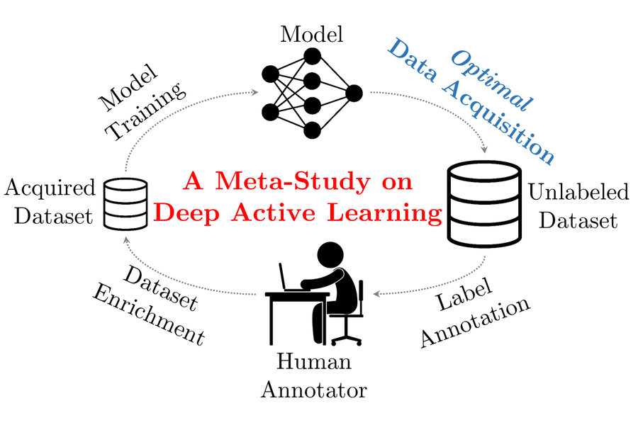

# Optimal Active Learning Behaviors



This is the code repository for the AISTATS 2021 paper [_Towards Understanding the Behaviors of Optimal Deep Active Learning Algorithms_](http://proceedings.mlr.press/v130/zhou21b.html) by Yilun Zhou, Adithya Renduchintala, Xian Li, Sida Wang, Yashar Mehdad and Asish Ghoshal. A brief video introduction is available [here](https://www.youtube.com/watch?v=McBC7H3BJFM).

There are three tasks, `object_classification`, `intent_classification`, and `named_entity_recognition`. Specific instructions are listed in `<task>/README.md` for each task.

Before proceeding, please download the preprocessed data as a zip file from [this link](http://bit.ly/optimal-al-data), and unpack the contents of `<task>/data/` into the the currently empty `<task>/data/` folder.

In `<task>/README.md`, the first step is to search for the optimal order, which takes several days _per search_ on 8 V100 GPUs, using the settings in the paper. Thus, we have saved the log files for each task. You can download all of them from [this link](http://bit.ly/optimal-al-logs), and unpack the contents of `<task>/logs/` into the currently empty `<task>/logs/` folder.

All the plots will be saved in `figures/<task>/` folder, which is currently populated with the those used in the paper.

The code should run with reasonably recent versions of `pytorch`, `numpy`, `scipy`, `matplotlib`, `scikit-learn`, etc. However, if there are any compatibility issues, please try again with the exact versions specified in [`requirements.txt`](requirements.txt), which contains a (more than) sufficient list of packages.

For any questions, please contact Yilun Zhou at yilun@mit.edu. The paper can be cited as
```
@inproceedings{zhou2021towards,
  title = {Towards Understanding the Behaviors of Optimal Deep Active Learning Algorithms},
  author = {Zhou, Yilun and Renduchintala, Adithya and Li, Xian and Wang, Sida and Mehdad, Yashar and Ghoshal, Asish},
  booktitle = {Proceedings of The 24th International Conference on Artificial Intelligence and Statistics},
  pages = {1486--1494},
  year = {2021},
  editor = {Arindam Banerjee and Kenji Fukumizu},
  volume = {130},
  series = {Proceedings of Machine Learning Research},
  month = {13--15 Apr},
  publisher = {PMLR},
  url = {http://proceedings.mlr.press/v130/zhou21b.html}
}
```
